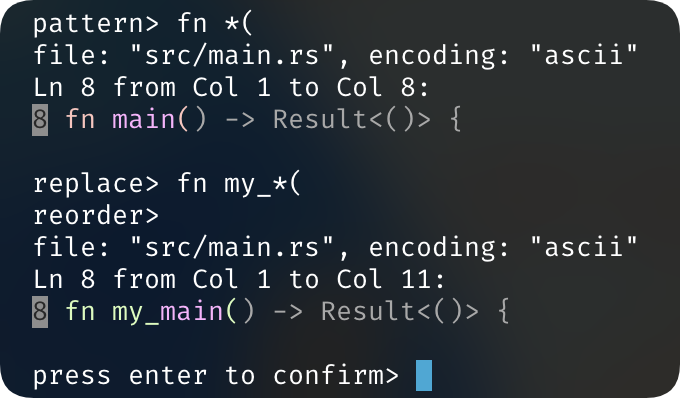

# Replaxe

A command-line tool to replace text in files with easy patterns.



## Usage

The usage help could be obtained by running `replaxe --help`:

```plaintext
Usage: replaxe [OPTIONS] [FILES]...

Arguments:
  [FILES]...  Files to search and replace in. Supports glob patterns

Options:
  -p, --pattern <PATTERN>    (Would be prompted if not specified) Pattern to search for, simply use `*` as a wildcard to match any string that could be referred from the replace pattern. Wildcards would be matched as short as possible
  -r, --replace <REPLACE>    (Would be prompted if not specified) Replace pattern, use `*` to refer to the nth captured group in the pattern
  -o, --reorder <REORDER>    (Would be prompted if not specified) Reorder the captured groups in the replace pattern, use `,` or `;` or ` ` or `\t` to separate the indexes. Indices that are not specified will be left in their original order
  -y, --yes                  Skip the confirmation prompt before actually overwriting the files
  -w, --wildcard <WILDCARD>  Override the wildcard character instead of `*` [default: *]
  -m, --multiline            Enable multiline input mode when prompting for patterns and replaces, type an empty line to submit the input
  -h, --help                 Print help
```
